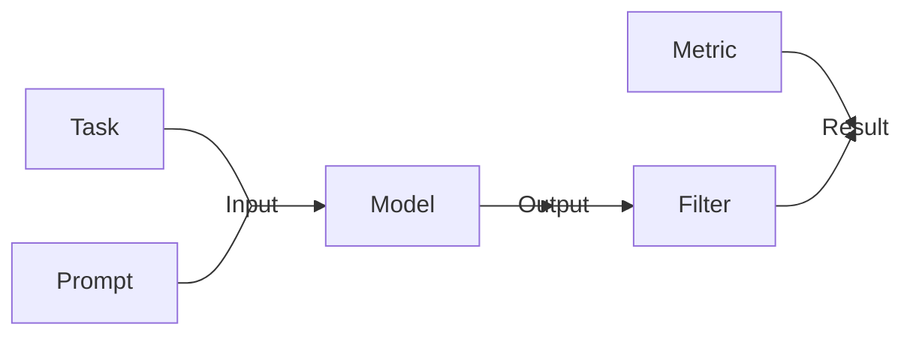

# Language Model Evaluation Harness


[](https://codecov.io/gh/EleutherAI/lm-evaluation-harness)

## Overview

This project provides a unified framework to test generative language models on a large number of different evaluation tasks.

### Features

- 200+ tasks implemented. See the [task-table](./docs/task_table.md) for a complete list.
- Support for the Hugging Face [transformers](https://github.com/huggingface/transformers) library, [GPT-NeoX](https://github.com/EleutherAI/gpt-neox), [Megatron-DeepSpeed](https://github.com/microsoft/Megatron-DeepSpeed), with flexible tokenization-agnostic interface.
- Support for commercial APIs including [OpenAI](https://openai.com/), [goose.ai](https://goose.ai/), [Anthropic](https://www.anthropic.com/), and [TextSynth](https://textsynth.com/).
- Support for evaluation on adapters (e.g. LoRA) supported in [HuggingFace's PEFT library](https://github.com/huggingface/peft).
- Support for GPTQ quantized models via [AutoGPTQ](https://github.com/PanQiWei/AutoGPTQ).
- Evaluating with publicly available prompts ensures reproducibility and comparability between papers.
- Task versioning to ensure reproducibility when tasks are updated.

### Evaluation Overview

`Task` and `Prompt` classes contain information that, when combined, produces the input to the language model. The language model is then queried to obtain an output. One or more `Filters` can then be applied to perform arbitrary operations on the model's raw output, such as selecting the final answer (for chain of thought) or calling an external API. This final output is then evaluated using a `Metric` to obtain the final result.



## Install

To install `lm-eval` from the github repository main branch, run:

```bash
git clone https://github.com/EleutherAI/lm-evaluation-harness
cd lm-evaluation-harness
pip install -e .
```

To install additional multilingual tokenization and text segmentation packages, you must install the package with the `multilingual` extra:

```bash
pip install -e ".[multilingual]"
```

To support loading GPTQ quantized models, install the package with the `auto-gptq` extra:

```bash
pip install -e ".[auto-gptq]"
```

## Basic Usage

> **Note**: When reporting results from eval harness, please include the task versions (shown in `results["versions"]`) for reproducibility. This allows bug fixes to tasks while also ensuring that previously reported scores are reproducible. See the [Task Versioning](#task-versioning) section for more info.

### Hugging Face `transformers`

To evaluate a model hosted on the [HuggingFace Hub](https://huggingface.co/models) (e.g. GPT-J-6B) on `lambada_openai` and `hellaswag` you can use the following command:

```bash
python main.py \
    --model hf-causal \
    --model_args pretrained=EleutherAI/gpt-j-6B \
    --tasks lambada_openai,hellaswag \
    --device cuda:0
```

Additional arguments can be provided to the model constructor using the `--model_args` flag. Most notably, this supports the common practice of using the `revisions` feature on the Hub to store partially trained checkpoints, or to specify the datatype for running a model:

```bash
python main.py \
    --model hf-causal \
    --model_args pretrained=EleutherAI/pythia-160m,revision=step100000,dtype="float" \
    --tasks lambada_openai,hellaswag \
    --device cuda:0
```

To evaluate models that are loaded via `AutoSeq2SeqLM`, you instead use `hf-seq2seq`.

> **Warning**: Choosing the wrong model may result in erroneous outputs despite not erroring.

Arguments provided via `--model_args` get passed to the relevant constructor directly. This means that anything you can do with `AutoModel` can be done with our library.

To use with [PEFT](https://github.com/huggingface/peft), take the call you would run to evaluate the base model and add `,peft=PATH` to the `model_args` argument as shown below:

```bash
python main.py \
    --model hf-causal \
    --model_args pretrained=EleutherAI/gpt-j-6b,peft=nomic-ai/gpt4all-j-lora \
    --tasks openbookqa,arc_easy,winogrande,hellaswag,arc_challenge,piqa,boolq \
    --device cuda:0
```

GPTQ quantized models can be loaded by specifying their file names in `,quantized=NAME` (or `,quantized=True` for default names) in the `model_args` argument:

```bash
python main.py \
    --model hf-causal \
    --model_args pretrained=model-name-or-path,quantized=model.safetensors,gptq_use_triton=True \
    --tasks hellaswag
```

### Commercial APIs

Our library also supports language models served via the OpenAI API:

```bash
export OPENAI_API_SECRET_KEY=YOUR_KEY_HERE
python main.py \
    --model gpt3 \
    --model_args engine=davinci \
    --tasks lambada_openai,hellaswag
```

While this functionality is only officially maintained for the official OpenAI API, it tends to also work for other hosting services that use the same API such as [goose.ai](goose.ai) with minor modification. We also have an implementation for the [TextSynth](https://textsynth.com/index.html) API, using `--model textsynth`.

To verify the data integrity of the tasks you're performing in addition to running the tasks themselves, you can use the `--check_integrity` flag:

```bash
python main.py \
    --model gpt3 \
    --model_args engine=davinci \
    --tasks lambada_openai,hellaswag \
    --check_integrity
```

### Other Frameworks

A number of other libraries contain scripts for calling the eval harness through their library. These include [GPT-NeoX](https://github.com/EleutherAI/gpt-neox/blob/main/eval_tasks/eval_adapter.py), [Megatron-DeepSpeed](https://github.com/microsoft/Megatron-DeepSpeed/blob/main/examples/MoE/readme_evalharness.md), and [mesh-transformer-jax](https://github.com/kingoflolz/mesh-transformer-jax/blob/master/eval_harness.py).

💡 **Tip**: You can inspect what the LM inputs look like by running the following command:

```bash
python write_out.py \
    --tasks all_tasks \
    --num_fewshot 5 \
    --num_examples 10 \
    --output_base_path /path/to/output/folder
```

This will write out one text file for each task.

## Multi-GPU Evaluation

Multi-GPU evaluation is supported through [accelerate](https://github.com/huggingface/accelerate). To initialize the distributed environment, run `accelerate config` in terminal and follow the prompts. Once the environment is configured, evaluations can be launched with:

```bash
accelerate launch main.py \
    --model hf-causal \
    --model_args pretrained=EleutherAI/pythia-12b \
    --tasks lambada_openai,arc_easy \
    --batch_size 16
```

**Warning**: Distributed evaluation requires launching multiple processes of the evaluation script. Running `python main.py *args*` instead of `accelerate launch main.py *args*` on machine with multiple GPUs will only run the evaluations on a single device (unless you instead use `use_accelerate=True` in `--model_args`).

## Implementing new tasks

To implement a new task in the eval harness, see [this guide](./docs/task_guide.md).

## Task Versioning

To help improve reproducibility, all tasks have a `VERSION` field. When run from the command line, this is reported in a column in the table, or in the "version" field in the evaluator return dict. The purpose of the version is so that if the task definition changes (i.e to fix a bug), then we can know exactly which metrics were computed using the old buggy implementation to avoid unfair comparisons. To enforce this, there are unit tests that make sure the behavior of all tests remains the same as when they were first implemented. Task versions start at 0, and each time a breaking change is made, the version is incremented by one.

When reporting eval harness results, please also report the version of each task. This can be done either with a separate column in the table, or by reporting the task name with the version appended as such: taskname-v0.

## Test Set Decontamination

To address concerns about train / test contamination, we provide utilities for comparing results on a benchmark using only the data points not found in the model training set. Unfortunately, outside of models trained on the Pile and C4, its very rare that people who train models disclose the contents of the training data. However this utility can be useful to evaluate models you have trained on private data, provided you are willing to pre-compute the necessary indices. We provide computed indices for 13-gram exact match deduplication against the Pile, and plan to add additional precomputed dataset indices in the future (including C4 and min-hash LSH deduplication).

For details on text decontamination, see the [decontamination guide](./docs/decontamination.md).

Note that the directory provided to the `--decontamination_ngrams_path` argument should contain the ngram files and info.json. See the above guide for ngram generation for the pile, this could be adapted for other training sets.

```bash
python main.py \
    --model gpt2 \
    --tasks sciq \
    --decontamination_ngrams_path path/containing/training/set/ngrams \
    --device cuda:0
```

## Cite as

```
@software{eval-harness,
  author       = {Gao, Leo and
                  Tow, Jonathan and
                  Biderman, Stella and
                  Black, Sid and
                  DiPofi, Anthony and
                  Foster, Charles and
                  Golding, Laurence and
                  Hsu, Jeffrey and
                  McDonell, Kyle and
                  Muennighoff, Niklas and
                  Phang, Jason and
                  Reynolds, Laria and
                  Tang, Eric and
                  Thite, Anish and
                  Wang, Ben and
                  Wang, Kevin and
                  Zou, Andy},
  title        = {A framework for few-shot language model evaluation},
  month        = sep,
  year         = 2021,
  publisher    = {Zenodo},
  version      = {v0.0.1},
  doi          = {10.5281/zenodo.5371628},
  url          = {https://doi.org/10.5281/zenodo.5371628}
}
```
