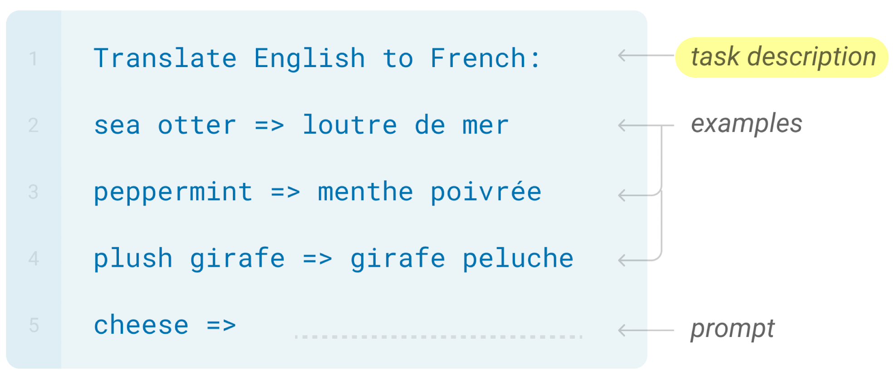

# Description Guide


(Figure from [Brown et al., 2020](https://arxiv.org/pdf/2005.14165.pdf))

Task descriptions provide in-context task instruction for your language model. If you'd like to prepend a natural language description to your few-shot examples and prompt, you can do so on a per-task basis via the `description_dict` arg of [`evaluator.evaluate`](../lm_eval/evaluator.py). This `description_dict` must adhere to the following key-value structure:

- **key**: the task name (`str`) as specified in the lm-eval-harness [task registry](../lm_eval/tasks/__init__.py).
- **value**: the corresponding (`str`) description/prompt for the task identified by **key**.

```python
description_dict = {
    "task_name_1": "description",
    "task_name_2": "description",
    ...
}
```

Note that a task's description will be separated from its following few-shot examples and prompt by a new line as such:

```python
"""
<description>

<examples>

<prompt>
"""
```

## Descriptions in File

One can also interface with the aforementioned [`evaluator.evaluate`](../lm_eval/evaluator.py) (or `evaluator.simple_evaluate`) method from a higher level by simply passing a JSON file path to the `description_dict_path` arg of the command-line interface (CLI) program, `main.py`. The JSON file pointed to should be structured the same as the `description_dict`. E.g. for some file at `/your/path/descriptions.json` you may have:

```json
{
    "cycle_letters": "Please unscramble the letters into a word, and write that word:",
    "copa": "Given a premise and one alternative with a causal relation to the premise and another without, choose the more plausible alternative"
}
```

which can then be supplied to the CLI as:

```bash
python main.py  \
--tasks cycle_letters,copa \
--description_dict_path /your/path/descriptions.json \
...
```
