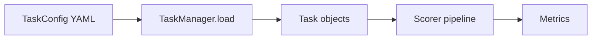

# Documentation Syntax Guide

author: claude

This project uses [mkdocstrings](https://mkdocstrings.github.io/) with the
[Python handler](https://mkdocstrings.github.io/python/) to render API
documentation on ReadTheDocs.  Docstrings are written in **Google style** and
use **Markdown link syntax** for cross-references.

!!! warning "Not Sphinx"
    This project does **not** use Sphinx.  RST-style roles like
    `:class:\`Foo\`` or `:meth:\`Bar.baz\`` **do not work** — they render
    as literal text.  Use the Markdown link syntax described below instead.

This guide covers the two places you write documentation:

1. **Python docstrings** — inline in `.py` files (Google style + Markdown cross-refs)
2. **Markdown pages** — `.md` files under `docs/` (standard Markdown + MkDocs extensions)

---

## Cheat Sheet

| What you want              | In docstrings                                        | In `.md` pages (Markdown)            |
|----------------------------|------------------------------------------------------|--------------------------------------|
| Inline code                | ` ``code`` `                                         | `` `code` ``                         |
| Bold                       | `**bold**`                                           | `**bold**`                           |
| Italic                     | `*italic*`                                           | `*italic*`                           |
| Link to function           | `[evaluate][lm_eval.evaluator.evaluate]`             | Same syntax, or use `:::` directives |
| Link to class              | `[TaskManager][lm_eval.tasks.TaskManager]`           | Same syntax                          |
| Link to method             | `[TaskManager.load][lm_eval.tasks.TaskManager.load]` | Same syntax                          |
| Relative link (same class) | `[load][.load]`                                      | N/A                                  |
| Scoped link (same module)  | `[GenScorer][GenScorer]`                             | N/A                                  |
| Code block                 | `Example::` + indented block                         | Fenced ` ``` ` block                 |
| Bullet list                | `* item` or `- item`                                 | `- item`                             |
| Numbered list              | `1. item`                                            | `1. item`                            |
| Heading                    | N/A (use sections like `Args:`)                      | `# H1` / `## H2` / `### H3`          |
| Admonition/callout         | `Note:` or `Warning:` sections                       | `!!! note` / `!!! warning`           |

---

## Part 1 — Python Docstrings (Google Style)

The project's `zensical.toml` sets `docstring_style = "google"`, so
mkdocstrings parses docstrings using
[Google style conventions](https://google.github.io/styleguide/pyguide.html#38-comments-and-docstrings).

### Basic Structure

```python
def simple_evaluate(
    model: str | LM,
    tasks: list[str] | None = None,
    num_fewshot: int | None = None,
) -> EvalResults | None:
    """High-level entry point for evaluation.

    Longer description goes here.  Can span multiple paragraphs.
    Blank lines separate paragraphs.

    Args:
        model: Name of model or LM object.
        tasks: List of task names or Task objects.
        num_fewshot: Number of examples in few-shot context.

    Returns:
        Dictionary of results, or None if not on rank 0.

    Raises:
        ValueError: If no tasks are provided.
    """
```

### Supported Sections

Google-style sections recognized by mkdocstrings:

| Section        | Use for                                      |
|----------------|----------------------------------------------|
| `Args:`        | Function/method parameters                   |
| `Returns:`     | Return value description                     |
| `Raises:`      | Exceptions the function may raise            |
| `Yields:`      | For generator functions                      |
| `Attributes:`  | Class or dataclass attributes                |
| `Example::`    | Code example block (note the double colon)   |
| `Note:`        | Important notes                              |
| `Warning:`     | Warnings                                     |
| `Todo:`        | Future work                                  |
| `See Also:`    | Related functions/classes                     |

### Args with Types

Types can be specified in the docstring or in the signature (preferred).
When types are already in the signature, don't duplicate them:

```python
# PREFERRED — types in signature, not repeated in docstring
def load(self, names: list[str], *, num_fewshot: int | None = None) -> TaskDict:
    """Load tasks by name.

    Args:
        names: List of task names, glob patterns, or file paths.
        num_fewshot: Override the task's default fewshot count.
    """

# ALSO VALID — types in docstring (useful when the signature isn't visible)
def load(self, names, num_fewshot=None):
    """Load tasks by name.

    Args:
        names (list[str]): List of task names, glob patterns, or file paths.
        num_fewshot (int | None): Override the task's default fewshot count.
    """
```

### Attributes Section (for dataclasses / classes)

Inline attribute docs

```python
@dataclass
class Group:
    """A named group of tasks."""

    group: str
    """Display name of the group."""

    group_alias: str | None = None
    """Optional alias for result display."""
```

---

## Part 2 — Cross-References (Inside Docstrings)

### Inline Code — Double Backticks ` `` `

In docstrings, inline code uses **double** backticks:

```python
"""Ignored if ``model`` argument is a LM object."""
"""Each entry follows the ``"metric"`` key plus optional kwargs."""
"""An empty list ``[]`` signals 'no explicit filters'."""
```

Double backticks render as monospace `code` in the docs.

### Cross-References — `[text][target]`

mkdocstrings uses **Markdown link syntax** for cross-references, not RST
roles. The general form is:

```
[display text][fully.qualified.python.path]
```

This renders as a **clickable hyperlink** to the target's documentation.

### How Path Resolution Works (preferred order)

The target is a **dotted Python import path** to the object.  With
`relative_crossrefs` and `scoped_crossrefs` enabled in `zensical.toml`,
you have three forms.  Prefer the shortest one that works — it keeps
docstrings readable.

**1. Scoped name — bare name, auto-resolved (preferred)**

With `scoped_crossrefs = true`, bare names are resolved by searching
the current scope (class members → module → parents):

```
[GenScorer][GenScorer]          # same module
[score_doc][score_doc]          # sibling method on same class
```

**2. Relative path with `.` prefix — when scoped is ambiguous**

With `relative_crossrefs = true`, a leading `.` means "relative to the
current object":

```
[from_dict][.from_dict]         # explicitly resolves to CurrentClass.from_dict
```

**3. Full path — for cross-module references**

Use the full import path when the target is in a different module:

```
[FilterStep][pkg.config.FilterStep]
[Scorer.reduce][pkg.scorers.Scorer.reduce]
```

### Syntax Variants

| Syntax                                           | Displayed as           | Notes                            |
|--------------------------------------------------|------------------------|----------------------------------|
| `[GenScorer][GenScorer]`                         | GenScorer              | Scoped lookup (same module)      |
| `[reduce][.reduce]`                              | reduce                 | Relative to current class        |
| `[Scorer][lm_eval.scorers.Scorer]`               | Scorer                 | Full path, explicit display text |
| `[Scorer.reduce][lm_eval.scorers.Scorer.reduce]` | Scorer.reduce          | Full path method reference       |
| `[lm_eval.scorers.Scorer][]`                     | lm_eval.scorers.Scorer | Auto-titled (full path shown)    |

### When to Use Which Form

| Situation                           | Recommended form                                                        |
|-------------------------------------|-------------------------------------------------------------------------|
| Target is in the **same class**     | Scoped: `[score_doc][score_doc]` or relative: `[score_doc][.score_doc]` |
| Target is in the **same module**    | Scoped: `[GenScorer][GenScorer]`                                        |
| Target is in a **different module** | Full path: `[FilterStep][lm_eval.config.task.FilterStep]`               |
| You want **custom display text**    | Explicit: `[see the scorer][lm_eval.scorers.Scorer]`                    |

### When to Use `[links]` vs ` ``backticks`` `

- Use `[text][path]` for: classes, functions, and methods that exist in
  your codebase and should be **clickable links**
- Use ` ``double backticks`` ` for: values, strings, variable names, dict
  keys, code snippets that **shouldn't link** anywhere

```python
# GOOD — link to a real class, backticks for a string value
"""Each entry follows the [FilterStep][lm_eval.config.task.FilterStep]
shape (``"function"`` key plus optional ``"kwargs"``)."""
```

### Important: The Target Must Be Documented

Cross-references only resolve into clickable links if the target object
appears somewhere in your built docs (i.e., it's pulled in by a `:::`
directive in some `.md` page).  If the target isn't documented, the
reference renders as plain text instead of a link.

### Code Blocks in Docstrings — `Example::`

Use `Example::` (with double colon) followed by an indented block:

```python
class TaskManager:
    """Central entry point for discovering and loading evaluation tasks.

    Example::

        tm = TaskManager(include_path="my_tasks/")
        result = tm.load(["mmlu", "hellaswag"])
        result["tasks"]   # {name: Task, ...}
        result["groups"]  # {name: Group, ...}
    """
```

The double colon `::` introduces a literal block.
Everything indented after a blank line is rendered as a code block.

For YAML examples:

```python
class ScorerConfig:
    """Configuration for a registered scorer.

    Example YAML::

        # String shorthand
        scorer: first_token
    """
```

### Bulleted / Numbered Lists in Docstrings

```python
"""Filter / metric precedence (highest to lowest):

1. Explicit ``cfg["filter"]`` / ``cfg["metric_list"]`` passed to ``from_dict``
2. ``cls.default_filter_cfg`` / ``cls.default_metric_cfg``
3. Hardcoded fallback (``noop`` / *global_metrics*)
"""
```

Or with bullets:

```python
"""
* ``None`` values are dropped.
* Any callable value is serialized with [serialize_callable][lm_eval.config.utils.serialize_callable].
"""
```

---

## Part 3 — Markdown Pages (`docs/*.md`)

The `.md` files under `docs/` use standard **Markdown** plus extensions
from [Material for MkDocs](https://squidfunk.github.io/mkdocs-material/)
and [PyMdownx](https://facelessuser.github.io/pymdown-extensions/).

### mkdocstrings Directives — Pulling in API Docs

The `:::` directive tells mkdocstrings to auto-generate documentation from
a Python object:

```markdown
# Entry Points

The main functions for running evaluations programmatically.

::: lm_eval.evaluator.simple_evaluate

::: lm_eval.evaluator.evaluate
```

With options:

```markdown
::: lm_eval.tasks.manager.TaskManager
    options:
      show_root_heading: true
```

Common options you can set per-directive:

| Option                 | Effect                                       |
|------------------------|----------------------------------------------|
| `show_root_heading`    | Show the object name as a heading            |
| `members`              | List specific members to show                |
| `show_source`          | Show source code link                        |
| `heading_level`        | Override heading level (default: page level)  |

### Links to GitHub Source

Use the Material icon button pattern:

```markdown
[:material-github: Source](https://github.com/EleutherAI/lm-evaluation-harness/blob/main/lm_eval/evaluator.py){ .md-button }

- `[:material-github: Source]` — renders a GitHub icon (from Material Design Icons) followed by the link text
- `(https://...)` — the target URL
- `{ .md-button }` — applies the `md-button` CSS class, rendering the link as a styled button
```

### Code Blocks

Standard fenced code blocks with syntax highlighting:

````markdown
```python
from lm_eval import evaluator
results = evaluator.simple_evaluate(model="hf", ...)
```

```yaml
task: my_task
dataset_path: my_dataset
output_type: multiple_choice
```
````

With line highlighting and annotations (enabled via `pymdownx.highlight`):

````markdown
```python hl_lines="2 3"
from lm_eval import evaluator
results = evaluator.simple_evaluate(  # (1)!
    model="hf",
    model_args="pretrained=gpt2",
)
```

1. This is an annotation explaining the highlighted line.
````

### Tabs

Use `pymdownx.tabbed` for tabbed content:

```markdown
=== "Python"

    ```python
    from lm_eval import evaluator
    evaluator.simple_evaluate(model="hf", tasks=["mmlu"])
    ```

=== "CLI"

    ```bash
    lm_eval --model hf --tasks mmlu
    ```
```

### Admonitions

Use `admonition` extension for callout boxes:

```markdown
!!! note
    Task names are case-sensitive.

!!! warning
    Running with `--confirm_run_unsafe_code` enables arbitrary code execution.

!!! tip "Performance"
    Use `--batch_size auto` to let the harness find the optimal batch size.

!!! example
    ```python
    tm = TaskManager()
    result = tm.load(["hellaswag"])
    ```
```

Collapsible admonitions (via `pymdownx.details`):

```markdown
??? note "Click to expand"
    Hidden content here.

???+ note "Expanded by default"
    Visible content here.
```

### Task Lists

```markdown
- [x] Implement scorer pipeline
- [x] Add metric registry
- [ ] Add custom scorer docs
```

### Tables

Standard Markdown tables:

```markdown
| Metric       | Type          | Aggregation |
|-------------|---------------|-------------|
| `acc`        | loglikelihood | `mean`      |
| `exact_match`| generation    | `mean`      |
```

### Mermaid Diagrams

Enabled via `pymdownx.superfences`:

````markdown

````

### Footnotes

```markdown
This uses bootstrap resampling[^1] for standard error estimation.

[^1]: See `bootstrap_iters` parameter in `simple_evaluate`.
```

---

## Tips

1. **Run locally** to preview: `zensical build` then open `site/index.html`.
   If cross-refs don't resolve, try `rm -rf .cache site` first.
2. **Cross-references only resolve** if the target object is documented
   (included via a `:::` directive somewhere)
3. **Indentation matters** for `Example::` blocks — use 4 spaces
4. The `signature_crossrefs = true` setting in `zensical.toml` means type
   annotations in signatures automatically become links where possible
5. **Don't duplicate types** — if the function signature has type hints,
   mkdocstrings renders them automatically; no need to repeat in `Args:`
6. The `relative_crossrefs` and `scoped_crossrefs` options in `zensical.toml`
   enable the shorter `[.sibling]` and `[SameName]` reference forms
