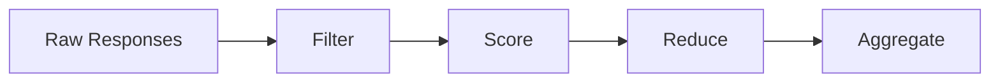

# Custom Scorers

Scorers encapsulate the full scoring pipeline — filters, metrics, reduction, and aggregation — in a single reusable class. This guide covers when and how to write custom scorers.

## When to write a custom scorer

Most tasks can be scored with YAML configuration alone (see [Scoring & Metrics](../writing_tasks/scoring_and_metrics.md)). Write a custom scorer when you need:

- **Custom per-doc scoring logic** (e.g., LLM-as-judge, code execution)
- **Batch-level scoring** (e.g., calling an external API for all docs at once)
- **Reusable scoring patterns** shared across multiple tasks

## The Scorer pipeline

Every scorer follows this pipeline:



1. **Filter** — Post-process model outputs (regex extraction, whitespace removal, etc.)
2. **Score** — Compare filtered outputs to gold references, producing per-sample metric values
3. **Reduce** — Collapse repeated runs per document (when `repeats > 1`)
4. **Aggregate** — Combine per-document scores into a single number (mean, median, etc.)

## Scorer class hierarchy

```
Scorer (ABC)
├── GenScorer — for generate_until tasks
│   ├── ChoiceMatchScorer — exact match against choices
│   ├── FirstTokenScorer — score based on first token
│   └── RegexExtractionScorer — regex-based answer extraction
└── LLScorer — for loglikelihood / multiple_choice tasks
```

- **`GenScorer`** — Use for generation tasks. Has three extensibility tiers.
- **`LLScorer`** — Use for loglikelihood tasks. Usually no subclassing needed.

## Extension tiers (GenScorer)

### Tier 1: Config-only (no code needed)

Set `default_filter_cfg` and/or `default_metric_cfg` class variables:

```python
from dataclasses import dataclass
from typing import Any, ClassVar

from lm_eval.api.registry import register_scorer
from lm_eval.scorers import GenScorer

@register_scorer("my_scorer")
@dataclass
class MyScorer(GenScorer):
    default_filter_cfg: ClassVar[list[dict[str, Any]]] = [
        {"function": "remove_whitespace"},
        {"function": "lowercase"},
    ]
    default_metric_cfg: ClassVar[list[dict[str, Any]]] = [
        {
            "metric": "exact_match",
            "aggregation": "mean",
            "higher_is_better": True,
            "kwargs": {"ignore_case": True},
        }
    ]
```

When no explicit filter/metric config is provided in the task YAML, these class defaults are used. This is how the built-in `FirstTokenScorer`, `RegexExtractionScorer`, and `ChoiceMatchScorer` are implemented.

### Tier 2: Per-doc scoring

Override `score(reference, predictions)` for custom per-document scoring logic:

```python
@register_scorer("custom_match")
@dataclass
class CustomMatchScorer(GenScorer):

    def score(self, reference, predictions):
        """Score a single document.

        Args:
            reference: Gold-standard answer (from doc_to_target)
            predictions: List of filtered model outputs (one per repeat)

        Returns:
            dict mapping metric names to lists of scores (one per repeat)
        """
        return {
            "custom_score": [
                1.0 if pred.strip().lower() == str(reference).lower() else 0.0
                for pred in predictions
            ]
        }
```

The `score()` method doesn't need to know about `Instance` objects — it receives clean inputs.

### Tier 3: Batch scoring (full control)

Override `score_instances()` for batch-level operations like external API calls:

```python
from lm_eval.api.registry import register_scorer
from lm_eval.scorers import GenScorer, ScoredDoc

@register_scorer("ai_judge")
@dataclass
class AIJudgeScorer(GenScorer):
    judge_model: str = "gpt-4"

    def score_instances(self, instances):
        """Score all documents in batch.

        Args:
            instances: dict[doc_id, list[Instance]] — all instances grouped by document

        Returns:
            dict[int, ScoredDoc] — one ScoredDoc per document
        """
        # _extract_inputs() is inherited from GenScorer — returns
        # (reference, predictions, metric_kwargs) for each document
        inputs = {
            did: self._extract_inputs(insts)
            for did, insts in instances.items()
        }

        # batch_judge() is your own function — call an external API,
        # run code in a sandbox, etc.
        ratings = batch_judge(
            self.judge_model,
            [(ref, preds) for ref, preds, _ in inputs.values()]
        )

        # Return scored results (must return dict[int, ScoredDoc])
        results = {}
        for (did, (ref, preds, mkw)), rating in zip(inputs.items(), ratings):
            results[did] = ScoredDoc(
                doc_id=did,
                reference=ref,
                scores={"judge_score": [rating]},
            )
        return results
```

## Configuration precedence

When building a scorer, filter and metric configs are resolved in this order:

1. **Explicit config** — `filter` / `metric_list` from the task YAML's `filter_list` entry
2. **Class defaults** — `default_filter_cfg` / `default_metric_cfg` ClassVars
3. **Fallback** — `noop` filter / `DEFAULT_METRIC_REGISTRY` based on `output_type`

## Registration and usage

Register with `@register_scorer`:

```python
from lm_eval.api.registry import register_scorer

@register_scorer("my_scorer")
@dataclass
class MyScorer(GenScorer):
    ...
```

Use in a task YAML:

```yaml
scorer:
  type: my_scorer
  kwargs:
    judge_model: "claude-sonnet-4-6"
```

Or let it be auto-configured via `filter_list`:

```yaml
filter_list:
  - name: "my-pipeline"
    filter:
      - function: "regex"
        regex_pattern: "(\\d+)"
      - function: "take_first"
    metric_list:
      - metric: exact_match
```

## The `build_scorer` factory

The `build_scorer()` function constructs a scorer from a normalized pipeline config:

```python
from lm_eval.scorers import build_scorer

scorer = build_scorer(
    cfg={
        "name": "strict-match",
        "filter": [
            {"function": "regex", "regex_pattern": "The answer is (\\d+)"},
            {"function": "take_first"},
        ],
        "metric_list": [
            {"metric": "exact_match", "aggregation": "mean"},
        ],
    },
    output_type="generate_until",
)
```

## Built-in scorer examples

### `FirstTokenScorer`

```python
@register_scorer("first_token")
@dataclass
class FirstTokenScorer(GenScorer):
    default_filter_cfg: ClassVar = [{"function": "remove_whitespace"}]
    default_metric_cfg: ClassVar = [
        {"metric": "exact_match", "aggregation": "mean",
         "higher_is_better": True,
         "kwargs": {"ignore_case": True, "ignore_punctuation": True}}
    ]
```

### `RegexExtractionScorer`

```python
@register_scorer("regex")
@dataclass
class RegexExtractionScorer(GenScorer):
    default_filter_cfg: ClassVar = [{"function": "regex"}]
    default_metric_cfg: ClassVar = [
        {"metric": "exact_match", "aggregation": "mean",
         "higher_is_better": True,
         "kwargs": {"ignore_case": True, "ignore_punctuation": True}}
    ]
```

Both use Tier 1 (config-only) — no custom scoring code needed. The regex pattern is passed via the filter config at the task level.
