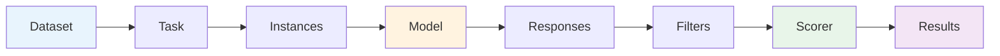

# Concepts & Architecture

This page gives you a mental model for how lm-eval works. Understanding the pipeline helps when configuring tasks, interpreting results, or extending the framework.

## The evaluation pipeline

Every evaluation follows this flow:



1. **Dataset** — Raw data loaded from HuggingFace Hub (or a local source). Each row is a `Doc` (a dictionary of field names to values).

2. **Task** — A YAML config (or Python class) that defines how to turn each document into a prompt. The key fields are:
   - `doc_to_text` — Jinja2 template or function producing the input prompt
   - `doc_to_target` — The gold-standard answer
   - `doc_to_choice` — For multiple-choice tasks, the list of answer options

3. **Instances** — Each document becomes one or more `Instance` objects — the actual requests sent to the model. The instance type depends on the task's `output_type`.

4. **Model** — An `LM` backend (HuggingFace, vLLM, OpenAI API, etc.) that processes instances and returns raw responses.

5. **Responses** — Raw model output: log-probabilities for `loglikelihood` tasks, generated text for `generate_until` tasks.

6. **Filters** — Optional post-processing pipelines applied to model responses before scoring. Examples: regex extraction, majority voting, stripping whitespace.

7. **Scorer** — Applies metrics to filtered responses. The scoring pipeline is: **filter → score → reduce → aggregate**.
   - **Score**: Compare each response to the gold reference (e.g., exact match, accuracy)
   - **Reduce**: Collapse repeated runs per document (e.g., take first, majority vote)
   - **Aggregate**: Combine per-document scores into a single number (e.g., mean, median)

8. **Results** — Final metric values with standard errors, organized by task and filter pipeline.

## Key vocabulary

| Term | What it means |
|---|---|
| **Task** | An evaluation definition: dataset + prompt template + scoring configuration. Defined in YAML or Python. |
| **Group** | A named collection of tasks, reported together (e.g., "mmlu" groups all MMLU subtasks). Can define aggregate metrics. |
| **Tag** | A label for tasks enabling batch selection (e.g., `tag: multiple_choice`). Lighter-weight than groups. |
| **Instance** | A single request to the model: one document × one request type. Generic over input/output types. |
| **Scorer** | Encapsulates the full scoring pipeline for a task: which filters to apply, which metrics to compute, and how to aggregate. |
| **Metric** | A function that scores a single model response against a reference (e.g., `acc`, `exact_match`, `bleu`). |
| **Filter** | A post-processing step applied to raw model output before scoring (e.g., regex extraction, lowercasing). |
| **Format** | A declarative prompt layout (e.g., `mcqa`, `cloze`, `generate`) that auto-generates Jinja templates from simple field mappings. Add `formats: mcqa` to a task YAML or use `--tasks my_task@mcqa` on the CLI. See [Prompt Formats](../writing_tasks/prompt_formats.md). |

## Output types

The `output_type` field in a task config determines what kind of request the model receives and what shape the response takes:

| Output type | Model method | What the model does | Response type |
|---|---|---|---|
| `multiple_choice` | `loglikelihood()` | Computes log-prob for each answer choice given the context | `list[tuple[float, bool]]` |
| `loglikelihood` | `loglikelihood()` | Computes log-prob of a single continuation given context | `tuple[float, bool]` |
| `loglikelihood_rolling` | `loglikelihood_rolling()` | Computes log-prob of the entire input (no context split) | `tuple[float, bool]` |
| `generate_until` | `generate_until()` | Generates text until a stop sequence is reached | `str` |

## Type system

The harness uses typed aliases throughout for clarity. The most important ones:

| Type | Definition | Meaning |
|---|---|---|
| `Doc` | `dict[str, Any]` | A single document (dataset row) |
| `Context` | `str \| list[dict[str, str]]` | Model input: a string prompt or chat messages |
| `LLArgs` | `tuple[str, str]` | Loglikelihood request: `(context, continuation)` |
| `LLOutput` | `tuple[float, bool]` | Loglikelihood result: `(logprob, is_greedy)` |
| `GenKwargs` | `TypedDict` | Generation parameters: `do_sample`, `temperature`, `max_gen_toks`, `until`, etc. |
| `GenArgs` | `tuple[Context, GenKwargs]` | Generation request: `(context, generation_kwargs)` |
| `Completion` | `str` | Generated text output |
| `LLInstance` | `Instance[LLArgs, list[LLOutput]]` | A loglikelihood instance with typed I/O |
| `GenInstance` | `Instance[GenArgs, list[Completion]]` | A generation instance with typed I/O |

## How configuration maps to code

```
YAML task config    →    TaskConfig dataclass    →    Task object
  dataset_path             .dataset_path                .dataset
  doc_to_text              .doc_to_text                 .doc_to_text()
  metric_list              .metric_list                 task.scorers[*].metrics
  filter_list              .filter_list                 task.scorers[*].filter
  formats                  .formats                     (generates doc_to_text/target/choice)
```

The `TaskManager` loads YAML configs, resolves inheritance (`include` directives), applies runtime overrides, and constructs `Task` objects ready for evaluation.

## Simplifying prompts with formats

Instead of writing Jinja templates by hand, you can use **prompt formats** to auto-generate them. Formats consume your `doc_to_text`, `doc_to_target`, and `doc_to_choice` field mappings and produce complete prompt templates automatically.

**Without formats** (manual Jinja):

```yaml
task: my_mcqa_task
dataset_path: my_org/my_dataset
test_split: test
output_type: multiple_choice
doc_to_text: "Question: {{question}}\n{{letter}}. {{choice}}\nAnswer:"
doc_to_target: "{{['A', 'B', 'C', 'D'][answer]}}"
doc_to_choice: "{{choices}}"
```

**With formats** (declarative):

```yaml
task: my_mcqa_task
dataset_path: my_org/my_dataset
test_split: test
doc_to_text: question
doc_to_target: answer
doc_to_choice: choices
formats: mcqa
```

Both produce the same A/B/C/D prompt layout — but the format version is simpler and less error-prone. You can also try different formats at runtime without touching YAML: `--tasks my_mcqa_task@generate`.

See [Prompt Formats](../writing_tasks/prompt_formats.md) for the full guide.

## What's next

- **Running evaluations**: [CLI Reference](../running_evals/cli_reference.md) or [Python API](../running_evals/python_api.md)
- **Creating tasks**: [Your First Task](../writing_tasks/your_first_task.md)
- **Understanding scoring**: [Scoring & Metrics](../writing_tasks/scoring_and_metrics.md)
- **Extending the framework**: [Custom Model Backend](../extending/custom_model.md)
