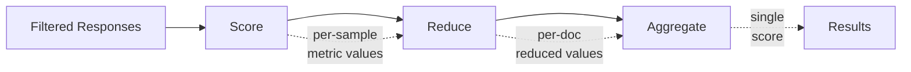

# Scoring & Metrics

This guide covers how the evaluation harness scores model outputs against gold-standard references, including the scorer pipeline, metrics, reductions, and aggregations.

## Overview

After the model produces responses and any [filters](filters.md) are applied, the **scoring pipeline** turns those responses into final metric values:



1. **Score** — Compare each response to the gold reference (e.g., does the output match the correct answer?)
2. **Reduce** — If `repeats > 1`, collapse multiple scores per document into one (e.g., take the first, majority vote, mean)
3. **Aggregate** — Combine per-document scores into a single number (e.g., mean accuracy across all documents)

## Default behavior

For most tasks, you don't need to configure scoring explicitly:

- **Multiple-choice tasks** (`output_type: multiple_choice`): Automatically scored with `acc` (accuracy) and `acc_norm` (length-normalized accuracy)
- **Generation tasks** (`output_type: generate_until`): No default metrics — you must specify `metric_list`
- **Loglikelihood tasks** (`output_type: loglikelihood_rolling`): Automatically scored with `perplexity`, `word_perplexity`, `byte_perplexity`, and `bits_per_byte`

## Configuring metrics in YAML

### Basic `metric_list`

List the metrics you want to compute:

```yaml
metric_list:
  - metric: exact_match
    aggregation: mean
    higher_is_better: true
  - metric: bleu
```

Each entry is a `MetricConfig` with these fields:

| Field | Type | Description |
|---|---|---|
| `metric` | str (required) | Name of a registered metric (e.g., `acc`, `exact_match`, `bleu`) |
| `aggregation` | str | How to combine per-doc scores into one number (default: metric's registered default) |
| `higher_is_better` | bool | Whether higher values indicate better performance (default: metric's registered default) |
| `reduction` | str | How to reduce repeated runs per document (default: `take_first`) |
| `kwargs` | dict | Extra arguments forwarded to the metric function |

### Passing arguments to metrics

Extra fields in a metric config entry are treated as kwargs:

```yaml
metric_list:
  - metric: exact_match
    aggregation: mean
    higher_is_better: true
    ignore_case: true           # Passed as kwarg to exact_match()
    ignore_punctuation: false
    regexes_to_ignore:
      - ","
      - "\\$"
```

## Built-in metrics

### Metrics

| Name | Description | Output types |
|---|---|---|
| `acc` | Accuracy (correct / total) | `multiple_choice` |
| `acc_norm` | Length-normalized accuracy | `multiple_choice` |
| `acc_mutual_info` | Baseline loglikelihood-normalized accuracy | `multiple_choice` |
| `exact_match` | Exact string match | `generate_until` |
| `perplexity` | Perplexity | `loglikelihood_rolling` |
| `word_perplexity` | Per-word perplexity | `loglikelihood_rolling` |
| `byte_perplexity` | Per-byte perplexity | `loglikelihood_rolling` |
| `bits_per_byte` | Bits per byte | `loglikelihood_rolling` |
| `matthews_corrcoef` | Matthews correlation coefficient | `multiple_choice` |
| `f1` | F1 score | `multiple_choice` |
| `bleu` | BLEU score (corpus-level) | `generate_until` |
| `chrf` | chrF score (corpus-level) | `generate_until` |
| `ter` | Translation error rate (corpus-level) | `generate_until` |

All metrics supported by [HuggingFace Evaluate](https://github.com/huggingface/evaluate/tree/main/metrics) can also be used — if a metric name isn't recognized as a built-in, the harness will attempt to load it from HF Evaluate.

### Aggregation functions

| Name | Description |
|---|---|
| `mean` | Arithmetic mean |
| `median` | Median |
| `perplexity` | Exp of mean log-likelihood |
| `weighted_perplexity` | Token-weighted perplexity |
| `bits_per_byte` | Bits per byte aggregation |

### Reduction functions (for `repeats > 1`)

| Name | Description |
|---|---|
| `take_first` | Use only the first repeat's score (default) |
| `mean` | Average across all repeats |
| `pass_at_k` | Probabilistic estimate of passing at least once in k attempts (standard Codex formula) |

## Scorers

Scorers encapsulate the full scoring pipeline — which filters to apply, which metrics to compute, and how to aggregate. For most tasks, `metric_list` and `filter_list` are sufficient and scorers are configured implicitly. Use explicit scorer config when you need custom scoring logic like LLM-as-judge, code execution, or reusable scoring patterns across tasks. See [Custom Scorers](../extending/custom_scorers.md) for implementation details.

### Built-in scorers

| Scorer | For | Description |
|---|---|---|
| `GenScorer` | `generate_until` tasks | Configurable generation scoring |
| `LLScorer` | `loglikelihood` / `multiple_choice` tasks | Log-likelihood based scoring |
| `ChoiceMatchScorer` | `generate_until` tasks | Extract and match a letter answer (A/B/C/D) |
| `FirstTokenScorer` | `generate_until` tasks | Score based on the first generated token |
| `RegexExtractionScorer` | `generate_until` tasks | Extract an answer using a regex pattern |

### Configuring scorers in YAML

Scorers are configured via the `scorer` field or are auto-configured by [formats](prompt_formats.md):

```yaml
# Explicit scorer configuration
scorer:
  type: regex_extraction
  kwargs:
    regex_pattern: "The answer is (\\w+)"
```

In practice, most tasks use the implicit scorer that is set up by the `filter_list` and `metric_list` fields, or by the `formats` field if using prompt formats.

### Precedence rules

When the harness resolves scoring configuration, the precedence is:

1. **Explicit config** — `filter_list` / `metric_list` in the YAML or passed as overrides
2. **Scorer class defaults** — `default_filter_cfg` / `default_metric_cfg` ClassVars on the scorer
3. **Fallback** — `noop` filter / output-type-appropriate default metrics

## Repeats and reduction

When `repeats > 1`, the model runs on each document multiple times (useful for self-consistency or sampling-based evaluation):

```yaml
repeats: 64
```

Each repeat produces a separate response, and the `reduction` function collapses them:

```yaml
metric_list:
  - metric: exact_match
    reduction: mean          # Average across 64 repeats
```

The default reduction is `take_first` — only the first repeat is scored. For self-consistency patterns, combine `repeats` with filter pipelines that do majority voting (see [Filters](filters.md)).

## Per-pipeline metrics

When using [multiple filter pipelines](filters.md#multiple-filter-pipelines), each pipeline can have its own metrics:

```yaml
filter_list:
  - name: "strict-match"
    filter:
      - function: "regex"
        regex_pattern: "The answer is (\\d+)"
      - function: "take_first"
    metric_list:
      - metric: exact_match

  - name: "flexible-match"
    filter:
      - function: "take_first"
    metric_list:
      - metric: exact_match
        ignore_case: true
```

If a pipeline doesn't specify `metric_list`, it inherits the task-level `metric_list`.

## Custom metrics

For metrics not built into the harness, you can use `!function` to reference a Python function:

```yaml
metric_list:
  - metric: !function utils.my_custom_metric
    aggregation: mean
    higher_is_better: true
```

For more details on implementing custom metrics, including the `Metric[_T, _K]` generic class and registration, see [Custom Metrics & Filters](../extending/custom_metrics_and_filters.md).
