# LiveCodeBench Code Execution System

## 🔍 Overview

The LiveCodeBench evaluation system executes AI-generated code **entirely in memory** without creating any temporary files. It uses Python's dynamic module creation, input/output mocking, and comprehensive sandboxing to safely evaluate code at scale.

## 🚫 **Key Point: No Temporary Files Created!**

The system executes code using:
- `exec()` function for in-memory compilation
- `ModuleType` for dynamic module creation  
- Input/output mocking for test case simulation
- Process isolation for safety

---

## 📊 Execution Flow Diagram

```mermaid
graph TD
    A["🔍 Model generates code"] --> B["📝 Extract code using extract_code_generation()"]
    B --> C["🎯 Determine problem type"]
    C --> D["📊 Standard Input/Output Problems"]
    C --> E["🔧 Function-based Problems"]
    
    D --> F["🧹 clean_if_name()<br/>Remove if __name__ == '__main__'"]
    F --> G["🎁 make_function()<br/>Wrap code in wrapped_function()"]
    G --> H["➕ Add import_string<br/>(all standard libraries)"]
    H --> I["⚡ compile_code()<br/>exec() in tmp_sol module"]
    I --> J["🎪 For each test case:<br/>call_method() with input mocking"]
    J --> K["📊 Capture stdout with Capturing()"]
    K --> L["✅ Compare output vs expected"]
    
    E --> M["➕ Add import_string + code"]
    M --> N["⚡ compile_code()<br/>exec() in tmp_sol module"]
    N --> O["🔍 Extract function by name"]
    O --> P["🎪 For each test case:<br/>Call function directly"]
    P --> Q["✅ Compare return value vs expected"]
    
    style A fill:#e1f5fe
    style B fill:#fff3e0
    style I fill:#ffebee
    style N fill:#ffebee
    style K fill:#e8f5e8
    style Q fill:#e8f5e8
```



---

## 🔧 Technical Implementation

### 1. Code Extraction & Preparation

```python
# Extract code from model output
generated_code = extract_code_generation(model_output)

# Determine execution type based on test case structure
in_outs = json.loads(sample['input_output'])
if in_outs.get('fn_name') is None:
    execution_type = CODE_TYPE.standard_input  # stdio problems
else:
    execution_type = CODE_TYPE.call_based      # function problems
```

### 2. Two Execution Paths

#### 🖥️ **Standard Input/Output Problems** 
*For competitive programming style problems that read from stdin and write to stdout*

**Step-by-step process:**

1. **Clean the code:**
```python
def clean_if_name(code: str) -> str:
    # Remove 'if __name__ == "__main__":' blocks
    # Extracts the main logic for execution
```

2. **Wrap in function:**
```python
def make_function(code: str) -> str:
    # Separates imports from main logic
    # Wraps main logic in 'wrapped_function()'
    # Returns: import_string + imports + wrapped_function()
```

3. **Add comprehensive imports:**
```python
import_string = '''
from string import *
from re import *
from datetime import *
from collections import *
from heapq import *
from bisect import *
from copy import *
from math import *
from random import *
from statistics import *
from itertools import *
from functools import *
from operator import *
from io import *
from sys import *
from json import *
from builtins import *
from typing import *
import string, re, datetime, collections, heapq, bisect, copy, math, random, statistics, itertools, functools, operator, io, sys, json
sys.setrecursionlimit(50000)
'''
```

4. **Compile in memory:**
```python
def compile_code(code: str, timeout: int):
    signal.alarm(timeout)
    try:
        tmp_sol = ModuleType('tmp_sol', '')  # Create dynamic module
        exec(code, tmp_sol.__dict__)         # Execute code in module namespace
        compiled_sol = tmp_sol
    finally:
        signal.alarm(0)
    return compiled_sol
```

5. **Execute with mocked input:**
```python
def call_method(method, inputs):
    # Mock all input sources
    @patch('builtins.open', mock_open(read_data=inputs))
    @patch('sys.stdin', StringIO(inputs))
    @patch('sys.stdin.readline', lambda *args: next(inputs_line_iterator))
    @patch('sys.stdin.readlines', lambda *args: inputs.split('\n'))
    @patch('sys.stdin.read', lambda *args: inputs)
    def _inner_call_method(_method):
        return _method()
    
    return _inner_call_method(method)
```

6. **Capture output:**
```python
class Capturing(list):
    def __enter__(self):
        self._stdout = sys.stdout
        sys.stdout = self._stringio = StringIO()
        return self
    
    def __exit__(self, *args):
        self.append(self._stringio.getvalue())  # Capture all print() output
        sys.stdout = self._stdout

# Usage:
with Capturing() as captured_output:
    call_method(method, test_input)
actual_output = captured_output[0]
```

#### 🔧 **Function-based Problems**
*For LeetCode-style problems with specific function signatures*

```python
def grade_call_based(code, all_inputs, all_outputs, fn_name, timeout):
    # 1. Add imports
    final_code = import_string + '\n\n' + code
    
    # 2. Compile in memory
    tmp_sol = ModuleType('tmp_sol', '')
    exec(final_code, tmp_sol.__dict__)
    
    # 3. Extract function/class
    if 'class Solution' in code:
        compiled_sol = tmp_sol.Solution()  # Instantiate Solution class
    else:
        compiled_sol = tmp_sol             # Use module directly
    
    method = getattr(compiled_sol, fn_name)
    
    # 4. Execute each test case
    for test_input, expected_output in zip(all_inputs, all_outputs):
        actual_output = method(*test_input)
        # Direct comparison of return values
```

---

## 🛡️ Security & Safety Measures

### Process Isolation
Each code execution runs in a separate `multiprocessing.Process`:

```python
def codegen_check_correctness(sample, generation, timeout, debug=False):
    manager = multiprocessing.Manager()
    result = manager.list()
    metadata_list = manager.list()
    
    p = multiprocessing.Process(
        target=_temp_run,
        args=(sample, generation, debug, result, metadata_list, timeout),
    )
    p.start()
    
    global_timeout = (timeout + 1) * len(test_cases)
    p.join(timeout=global_timeout)
    
    if p.is_alive():
        p.kill()  # Force kill if still running
```

### Sandboxing (`reliability_guard()`)
Disables dangerous functions before code execution:

```python
def reliability_guard(maximum_memory_bytes=None):
    # Memory limits
    if maximum_memory_bytes is not None:
        import resource
        resource.setrlimit(resource.RLIMIT_AS, (maximum_memory_bytes, maximum_memory_bytes))
        resource.setrlimit(resource.RLIMIT_DATA, (maximum_memory_bytes, maximum_memory_bytes))
    
    # Disable dangerous builtins
    import builtins
    builtins.exit = None
    builtins.quit = None
    
    # Disable dangerous os functions
    import os
    os.kill = None
    os.system = None
    os.putenv = None
    os.remove = None
    os.removedirs = None
    os.rmdir = None
    os.rename = None
    os.unlink = None
    os.chmod = None
    os.chown = None
    os.chroot = None
    os.chdir = None
    
    # Disable subprocess
    import subprocess
    subprocess.Popen = None
    
    # Disable dangerous modules
    import sys
    sys.modules['ipdb'] = None
    sys.modules['joblib'] = None
    sys.modules['resource'] = None
    sys.modules['psutil'] = None
    sys.modules['tkinter'] = None
```

### Timeout Protection
Uses `signal.alarm()` to kill runaway code:

```python
def timeout_handler(debug, signum, frame):
    if debug:
        logger.info('timeout occurred: alarm went off')
    raise TimeoutException

signal.signal(signal.SIGALRM, timeout_handler_wrapper)
signal.alarm(timeout)  # Set timeout
try:
    # Execute code
except TimeoutException:
    # Handle timeout
finally:
    signal.alarm(0)  # Reset alarm
```

---

## 📋 Complete Execution Example

Let's trace through a simple example:

### Input Problem
```
Problem: Read two integers and output their sum
Input: "5 3"
Expected Output: "8"
```

### Generated Code
```python
A, B = map(int, input().split())
print(A + B)
```

### Execution Steps

1. **Code cleaning:** No `if __name__ == '__main__'` to remove

2. **Function wrapping:**
```python
def wrapped_function():
    A, B = map(int, input().split())
    print(A + B)
```

3. **Final code with imports:**
```python
from string import *
from re import *
# ... all other imports ...

def wrapped_function():
    A, B = map(int, input().split())
    print(A + B)
```

4. **In-memory compilation:**
```python
tmp_sol = ModuleType('tmp_sol', '')
exec(final_code, tmp_sol.__dict__)
method = getattr(tmp_sol, 'wrapped_function')
```

5. **Execution with mocked input:**
```python
# Mock input() to return "5 3"
with Capturing() as captured_output:
    with patch('sys.stdin', StringIO("5 3")):
        method()

# captured_output[0] contains "8\n"
```

6. **Output comparison:**
```python
actual = "8\n".strip()    # "8"
expected = "8"
result = (actual == expected)  # True - Test passes!
```

---

## 🎯 Key Advantages

| Advantage | Description |
|-----------|-------------|
| **🚀 Speed** | No file I/O overhead, pure in-memory execution |
| **🛡️ Security** | Comprehensive sandboxing and process isolation |
| **🔄 Isolation** | Each test runs in separate process |
| **🎭 Flexibility** | Handles both stdio and function-based problems |
| **📊 Precision** | Decimal-precision output comparison |
| **⏱️ Reliability** | Timeout protection prevents hangs |

---

## 🔍 Code Files Overview

| File | Purpose |
|------|---------|
| `testing_util.py` | Core execution engine, sandboxing, I/O mocking |
| `utils.py` | High-level evaluation flow, result processing |
| `pass_k_utils.py` | Metrics calculation (pass@k) |

### Key Functions
- `run_test()` - Main entry point for code execution
- `grade_stdio()` - Execute standard input/output problems  
- `grade_call_based()` - Execute function-based problems
- `compile_code()` - In-memory code compilation
- `call_method()` - Input mocking for stdio problems
- `reliability_guard()` - Security sandboxing

---

## 🚨 Error Handling

The system handles various failure modes:

| Error Type | Code | Description |
|------------|------|-------------|
| **Compilation Error** | `-2` | Code fails to compile/parse |
| **Runtime Error** | `-4` | Code throws exception during execution |
| **Timeout** | `-3` | Code exceeds time limit |
| **Wrong Answer** | `False` | Output doesn't match expected |
| **Correct Answer** | `True` | Output matches expected |

---

## 🎓 Summary

The LiveCodeBench execution system is a sophisticated, **file-free** code evaluation platform that:

1. **Executes code entirely in memory** using `exec()` and dynamic modules
2. **Mocks all input/output** for realistic test case simulation  
3. **Provides comprehensive security** through sandboxing and process isolation
4. **Handles multiple problem types** (stdio and function-based)
5. **Ensures reliability** with timeout protection and error handling

This design enables **fast**, **secure**, and **scalable** evaluation of AI-generated code without the overhead and security risks of temporary file creation. 