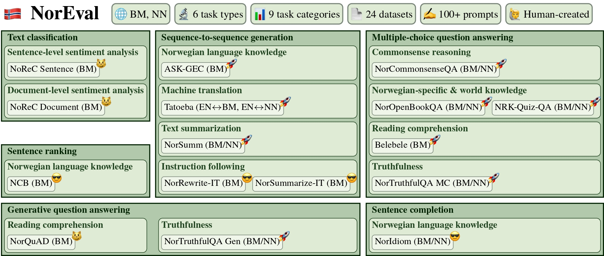

# 🇳🇴 NorEval

### Paper

* Title: `NorEval: A Norwegian Language Understanding and Generation Evaluation Benchmark`
* Abstract: [arxiv.org/abs/2504.07749](https://arxiv.org/abs/2504.07749)
* Homepage: [github.com/ltgoslo/noreval](https://github.com/ltgoslo/noreval/tree/main)



**Overview of the NorEval design.**  😼 denotes datasets used in [NorBench](https://aclanthology.org/2023.nodalida-1.61/), [NLEBench](https://aclanthology.org/2024.emnlp-main.317/), [ScandEval](https://aclanthology.org/2023.nodalida-1.20/), and [SEB](https://proceedings.neurips.cc/paper_files/paper/2024/file/4746bb91bd073ec7eef930d5775122ba-Paper-Datasets_and_Benchmarks_Track.pdf); 🚀 represents datasets that have not been used in the existing Norwegian benchmarks; and 😎 denotes our novel datasets introduced as part of NorEval. EN=English; BM=Norwegian Bokmål; NN=Norwegian Nynorsk.

🇳🇴 NorEval is a multi-task Norwegian language understanding and generation evaluation benchmark that combines 19 existing peer-reviewed datasets with five datasets created from scratch. NorEval covers nine diverse task categories: sentiment analysis, Norwegian language knowledge, Norwegian-specific \& world knowledge, machine reading comprehension, commonsense reasoning, machine translation, text summarization, instruction following, and truthfulness. Our main evaluation principles are:

- 🌐 **Linguistic diversity**: support for both of the official written standards of Norwegian: Bokmål and Nynorsk (the minority variant).
- 📊 **Task diversity**: coverage of various least addressed tasks for Norwegian. In particular, only three out of 24 NorEval datasets are included in existing Norwegian benchmarks to date: [NorBench](https://aclanthology.org/2023.nodalida-1.61/), [NLEBench](https://aclanthology.org/2024.emnlp-main.317/), [ScandEval](https://aclanthology.org/2023.nodalida-1.20/), and [SEB](https://proceedings.neurips.cc/paper_files/paper/2024/file/4746bb91bd073ec7eef930d5775122ba-Paper-Datasets_and_Benchmarks_Track.pdf).
- 🧠 **Data quality**: focus on only peer-reviewed human-created datasets to ensure reliable evaluation in the context of the Norwegian language, culture, and values.
- 📏 **Prompt sensitivity**: evaluation across 100+ human-written prompts to account for the prompt sensitivity.
- 👩🏻‍🔬 **Standardized evaluation**: integration of NorEval into LM Evaluation Harness for flexible and reproducible evaluation.


### Tasks

|Name  |Bokmål | Nynorsk  |*k*-shot | Task type  | Task category |
|:---|:---|:---|:---|:---|:---|
|[NoReC Sentence](https://huggingface.co/datasets/ltg/norec_sentence) |```norec_sentence```  | ❌ |✅ |Text classification| Sentiment analysis |
|[NoReC Document](https://huggingface.co/datasets/ltg/norec_document) |```norec_document```  | ❌ |✅ |Text classification| Sentiment analysis |
|[NCB](https://huggingface.co/datasets/hcfa/ncb) |```ncb```| ❌ | ❌ |Sentence ranking| Norwegian language knowledge   |
|[NorIdiom](https://huggingface.co/datasets/Sprakbanken/Norwegian_idioms) |```noridiom_nob```  | ```noridiom_nno```  | ❌ |Sentence completion| Norwegian language knowledge  |
|[Belebele](https://huggingface.co/datasets/facebook/belebele) |```norbelebele```| ❌|❌ |Multiple-choice question answering| Machine reading comprehension |
|[NRK-Quiz-QA](https://huggingface.co/datasets/ltg/nrk_quiz_qa) |```nrk_quiz_qa_nob```| ```nrk_quiz_qa_nno```| ❌   |Multiple-choice question answering| Norwegian-specific & world knowledge |
|[NorOpenBookQA](https://huggingface.co/datasets/ltg/noropenbookqa) |```noropenbookqa_nob```| ```noropenbookqa_nno``` |✅  |Multiple-choice question answering| Norwegian-specific & world knowledge |
|[NorCommonsenseQA](https://huggingface.co/datasets/ltg/norcommonsenseqa) |```norcommonsenseqa_nob```| ```norcommonsenseqa_nno``` |❌   |Multiple-choice question answering|Commonsense reasoning  |
|[NorTruthfulQA Multiple choice](https://huggingface.co/datasets/ltg/nortruthfulqa_mc) |```nortruthfulqa_mc_nob```| ```nortruthfulqa_mc_nno``` |❌   |Multiple-choice question answering |Truthfulness |
|[NorQuAD](https://huggingface.co/datasets/ltg/norquad) |```norquad```| ❌  | ✅  |Generative question answering |Machine reading comprehension |
|[NorTruthfulQA Generation](https://huggingface.co/datasets/ltg/nortruthfulqa_gen) |```nortruthfulqa_gen_nob```| ```nortruthfulqa_gen_nno``` | ❌   | Generative question answering|Truthfulness |
|[ASK-GEC](https://huggingface.co/datasets/ltg/ask-gec) |```ask_gec```| ❌ |✅ |Sequence-to-sequence generation|Norwegian language knowledge |
|[NorSumm](https://huggingface.co/datasets/SamiaT/NorSumm)  |```norsumm_nob``` | ```norsumm_nno```  |✅ |Sequence-to-sequence generation|Text summarization |
|[Tatoeba (English → Bokmål/Nynorsk)](https://huggingface.co/datasets/Helsinki-NLP/tatoeba_mt) | ```tatoeba_eng_nob```| ```tatoeba_eng_nno```  |✅  |Sequence-to-sequence generation|Machine translation |
|[Tatoeba (Bokmål/Nynorsk → English)](https://huggingface.co/datasets/Helsinki-NLP/tatoeba_mt) | ```tatoeba_nob_eng```| ```tatoeba_nno_eng```  |✅  |Sequence-to-sequence generation|Machine translation |
|[NorRewrite-Instruct](https://huggingface.co/datasets/ltg/norrewrite-instruct) |```norrewrite_instruct```  |❌ |❌ |Sequence-to-sequence generation|Instruction following|
|[NorSummarize-Instruct](https://huggingface.co/datasets/ltg/norsummarize-instruct) |```norsummarize_instruct``` |❌ |❌ |Sequence-to-sequence generation|Instruction following|

<details open>
<summary><b>Table description</b></summary>

* **Name**: a dataset name with a HuggingFace link.
* **Bokmål**: the LM Evaluation Harness task name for the Norwegian Bokmål dataset.
* **Nynorsk**: the LM Evaluation Harness task name for the Norwegian Nynorsk dataset, if available.
* **k-shot**: the support for *k*-shot evaluation regimes with *k* > 0. We follow the original datasets' design and focus mainly on the zero-shot evaluation by default.
  * ✅ means that the user can run the evaluation in both zero-shot and *k*-shot regimes.
  * ❌ denotes that only the zero-shot evaluation regime is available due to the lack of the training or validation set to sample the demonstration examples from. Technically, *k*-shot evaluation on the test set is possible using sampling without replacement, given that the model is not proprietary and not accessed via an API.
* **Task type**: the task type.
* **Task category**: the task category.

</details>

##### Comments on Belebele
Belebele for Norwegian Bokmål is already available in LM Evaluation Harness as `belebele_nob_Latn`. However, our version (`norbelebele`) supports five prompt templates written by Norwegian native speakers, which are different from the default prompt template used in Belebele.


### Citation

```
@article{mikhailov2025noreval,
  title={NorEval: A Norwegian Language Understanding and Generation Evaluation Benchmark},
  author={Mikhailov, Vladislav and Enstad, Tita and Samuel, David and Farseth{\aa}s, Hans Christian and Kutuzov, Andrey and Velldal, Erik and {\O}vrelid, Lilja},
  journal={arXiv preprint arXiv:2504.07749},
  year={2025}
}
```

### Checklist

* [x] Is the task an existing benchmark in the literature?
  * [x] Have you referenced the original paper that introduced the task?
  * [ ] If yes, does the original paper provide a reference implementation?
    * [ ] Yes, original implementation contributed by author of the benchmark

If other tasks on this dataset are already supported:
* [x] Is the "Main" variant of this task clearly denoted?
* [x] Have you provided a short sentence in a README on what each new variant adds / evaluates?
* [ ] Have you noted which, if any, published evaluation setups are matched by this variant?
